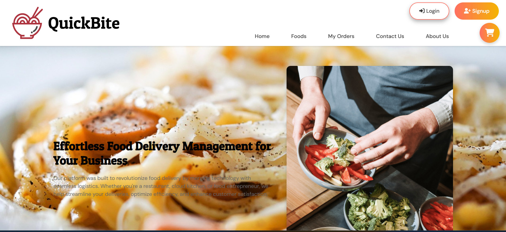
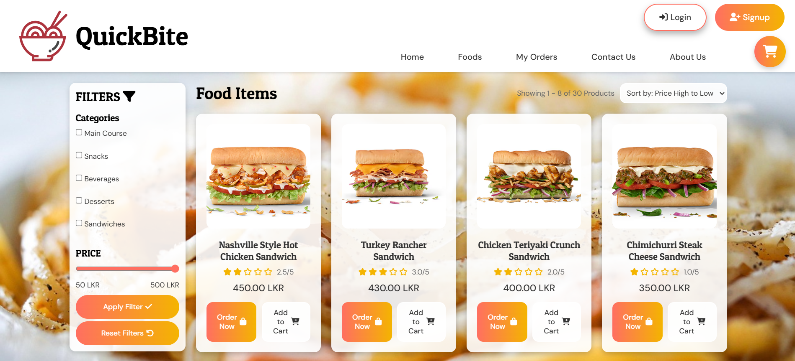
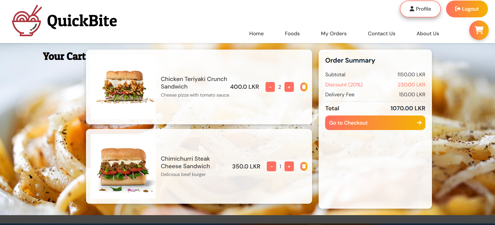
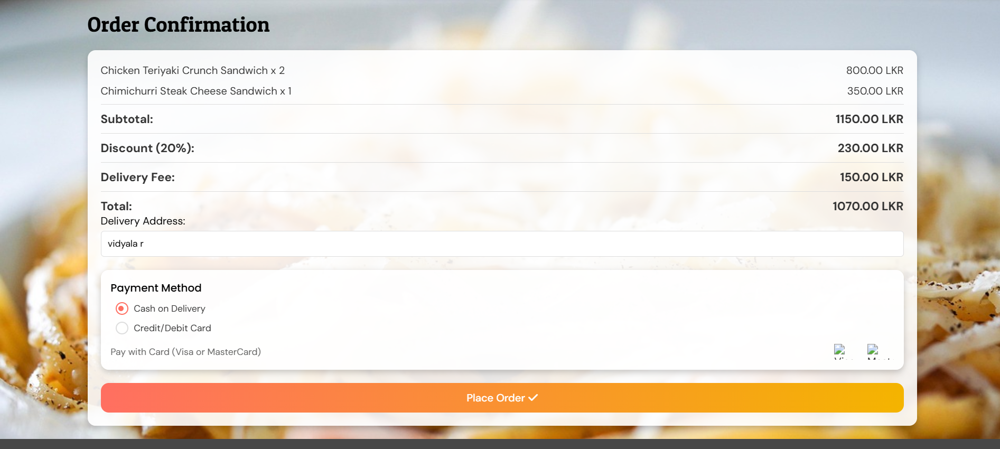
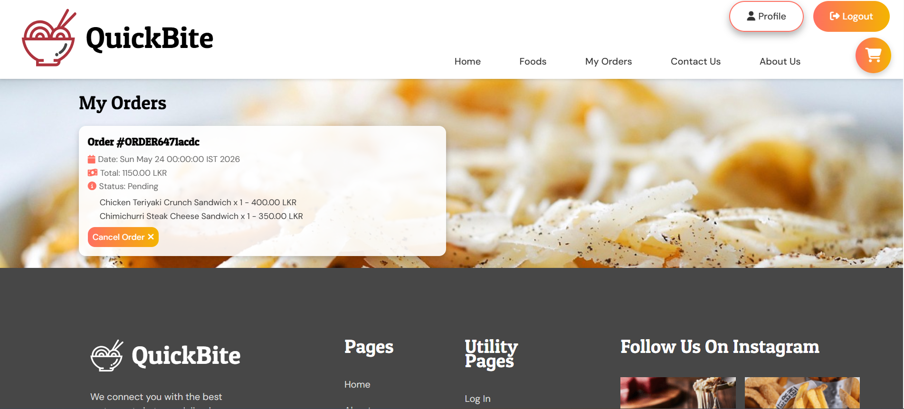
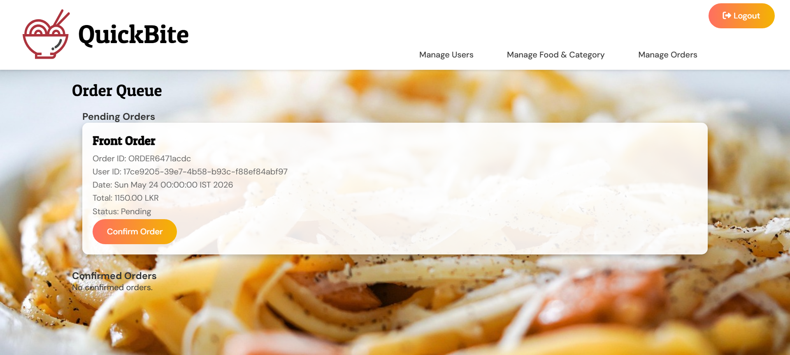
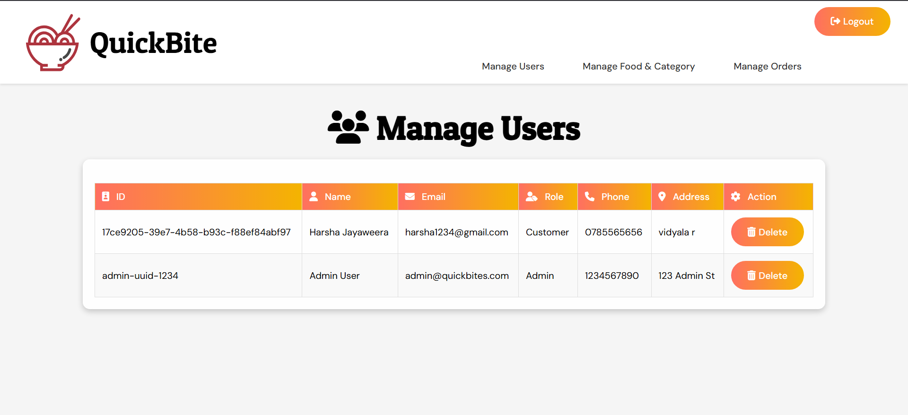

# 🍕 Quick Bite - Online Food Delivery Management System

A Java-based Online Food Delivery Management System with Custom DSA Implementation.

## 📋 Table of Contents

- [Overview](#overview)
- [Features](#features)
- [Data Structures & Algorithms](#data-structures--algorithms)
- [Tech Stack](#tech-stack)
- [Architecture](#architecture)
- [Project Structure](#project-structure)
- [Installation & Setup](#installation--setup)
- [Usage](#usage)
- [Screenshots](#screenshots)

## 🎯 Overview

Quick Bite is a comprehensive web application that simulates real-world food delivery operations. The project showcases practical implementation of Data Structures and Algorithms (DSA) concepts including **Circular Queue** for order management and **QuickSort** algorithm for food item sorting.

The system supports two types of users:
- **Customers**: Browse menu, add items to cart, place orders, and track order status
- **Admins**: Manage food items, categories, view order queue, and process orders

## ✨ Features

### Customer Features
- 👤 User registration and authentication
- 🍽️ Browse food items by categories
- 🔍 Filter and sort food items by price
- 🛒 Shopping cart management
- 📦 Place and track orders
- 📝 View order history
- 👨‍💼 Profile management

### Admin Features
- 📊 Dashboard with order statistics
- 🍔 Add, update, and delete food items
- 📑 Manage food categories
- 📋 View and manage order queue
- ✅ Confirm/reject orders
- 👥 User management

## 🔢 Data Structures & Algorithms

This project implements custom DSA concepts to showcase practical applications:

### 1. Circular Queue (Order Queue Management)
**Implementation**: `CustomOrderQueue.java`

A circular queue data structure is implemented to manage pending orders efficiently:

```java
public class CustomOrderQueue {
    private Order[] orders;
    private int front;      // Index of the front element
    private int rear;       // Index where the next element will be added
    private int size;       // Current number of elements
    private int capacity;   // Total capacity of the queue (100)
}
```

**Why Circular Queue?**
- **Efficient Memory Usage**: Reuses array space in a circular manner
- **FIFO Order Processing**: Orders are processed in First-In-First-Out manner, ensuring fair service
- **Fixed Capacity**: Demonstrates real-world constraints (maximum 100 pending orders)
- **O(1) Operations**: Constant time complexity for enqueue and dequeue operations

**Key Operations**:
- `addOrder()`: Add new order to the rear of queue
- `removeOrder()`: Process and remove order from front of queue
- `peekOrder()`: View the next order without removing it
- Uses modulo arithmetic `(rear + 1) % capacity` to create circular behavior


### 2. QuickSort Algorithm (Food Item Sorting)
**Implementation**: `FoodItemService.java`

QuickSort algorithm is implemented to sort food items by price:

```java
private void quickSort(List<FoodItem> items, int low, int high, boolean ascending) {
    if (low < high) {
        int pi = partition(items, low, high, ascending);
        quickSort(items, low, pi - 1, ascending);
        quickSort(items, pi + 1, high, ascending);
    }
}
```

**Why QuickSort?**
- **Efficient Sorting**: Average time complexity of O(n log n)
- **In-Place Sorting**: Minimal additional memory requirements
- **Flexible**: Supports both ascending and descending order
- **Practical Application**: Helps customers find food within their budget


## 🛠️ Tech Stack

### Backend
- **Language**: Java 22
- **Server**: Apache Tomcat 10.1+
- **Servlet API**: Jakarta Servlet 6.1.0
- **JSP**: Jakarta Server Pages 3.1.1
- **Build Tool**: Maven
- **Data Storage**: Text files (.txt)

### Frontend
- **View**: JSP (JavaServer Pages)
- **Styling**: CSS3

### Architecture Pattern
- **MVC (Model-View-Controller)**


## 📁 Project Structure

```
Online-Food-Delivery-Management-System/
│
├── src/
│   └── main/
│       ├── java/
│       │   ├── controller/              # Servlet Controllers
│       │   │   ├── UserServlet.java
│       │   │   ├── FoodItemServlet.java
│       │   │   ├── CartServlet.java
│       │   │   ├── OrderServlet.java
│       │   │   └── OrderQueueServlet.java
│       │   │
│       │   ├── model/                   # Domain Models
│       │   │   ├── User.java
│       │   │   ├── Admin.java
│       │   │   ├── Customer.java
│       │   │   ├── FoodItem.java
│       │   │   ├── Order.java
│       │   │   ├── Cart.java
│       │   │   ├── Category.java
│       │   │   └── CustomOrderQueue.java  # ⭐ Circular Queue Implementation
│       │   │
│       │   └── service/                 # Business Logic
│       │       ├── UserService.java
│       │       ├── FoodItemService.java      # ⭐ QuickSort Implementation
│       │       ├── OrderService.java
│       │       ├── OrderQueueService.java
│       │       ├── CartService.java
│       │       └── CategoryService.java
│       │
│       └── webapp/
│           ├── index.jsp                # Home page
│           ├── login.jsp                # Login page
│           ├── signup.jsp               # Registration page
│           ├── foods.jsp                # Food listing page
│           ├── cart.jsp                 # Shopping cart
│           ├── order.jsp                # Order placement
│           ├── myorders.jsp             # Order history
│           ├── profile.jsp              # User profile
│           ├── about.jsp                # About page
│           ├── contact.jsp              # Contact page
│           ├── header.jsp               # Header component
│           ├── footer.jsp               # Footer component
│           │
│           ├── css/                     # Stylesheets
│           │   ├── index.css
│           │   ├── login.css
│           │   ├── cart.css
│           │   ├── admin.css
│           │   └── ...
│           │
│           ├── images/                  # Food images
│           │   ├── F001.avif - F030.avif
│           │   ├── background.jpg
│           │   └── delivery.jpg
│           │
│           ├── external/                # External assets
│           │   └── icons, vectors, etc.
│           │
│           └── WEB-INF/
│               ├── web.xml              # Deployment descriptor
│               │
│               ├── views/               # Admin views
│               │   ├── food/
│               │   │   └── adminDashboard.jsp
│               │   ├── order/
│               │   │   └── adminOrderQueue.jsp
│               │   └── user/
│               │       └── adminUserManagement.jsp
│               │
│               └── resources/
│                   └── data/            # ⭐ Text File Storage
│                       ├── users.txt
│                       ├── fooditems.txt
│                       ├── orders.txt
│                       ├── categories.txt
│                       └── carts.txt
│
├── pom.xml                              # Maven configuration
├── .gitignore
└── README.md
```

## 🚀 Installation & Setup

### Prerequisites

- **Java Development Kit (JDK) 22** or higher
- **Apache Maven 3.6+**
- **Apache Tomcat 10.1+**
- **IDE** (IntelliJ IDEA, Eclipse, or NetBeans)

### Steps

1. **Clone the repository**
   ```bash
   git clone https://github.com/HarshaJayaweera21/QuickBite-WebApp.git
   cd online-food-delivery-system
   ```

2. **Build the project with Maven**
   ```bash
   mvn clean install
   ```

3. **Configure Tomcat**
   - Install Apache Tomcat 10.1 or higher
   - Set CATALINA_HOME environment variable
   - Configure server in your IDE

4. **Deploy the application**
   - Copy the generated WAR file from `target/` folder to Tomcat's `webapps` directory
   - Or deploy directly from your IDE

5. **Start Tomcat server**
   ```bash
   # Linux/Mac
   $CATALINA_HOME/bin/startup.sh
   
   # Windows
   %CATALINA_HOME%\bin\startup.bat
   ```

6. **Access the application**
   - Open browser and navigate to: `http://localhost:8080/Online-Food-Delivery-Management-System-1.0-SNAPSHOT/`
   - Or the context path configured in your server


## 📸 Screenshots

### Customer Interface

#### Home Page
*Landing page with featured food items and categories*


#### Food Menu
*Browse all available food items with filtering and sorting options*


#### Shopping Cart
*Review items before checkout*


#### Order Placement
*Enter delivery details and confirm order*


#### My Orders
*Track order history and status*


### Admin Interface

#### Order Queue
*View and process pending orders using Circular Queue*


#### User Management
*Manage customer accounts*



## 🔑 Key Highlights

### DSA Implementation Benefits

1. **Circular Queue for Order Management**
   - Efficient O(1) time complexity for order operations
   - Fair FIFO processing of customer orders
   - Fixed capacity demonstrates real-world constraints
   - Eliminates need for complex queue shifting operations

2. **QuickSort for Food Sorting**
   - Fast O(n log n) average case sorting
   - Flexible ascending/descending order
   - Enhances user experience with instant sorting
   - Demonstrates practical algorithm application

3. **File-based Storage**
   - Simplifies deployment (no database setup required)
   - Easy to understand and modify
   - Demonstrates fundamental file I/O operations
   - Suitable for learning and prototyping

